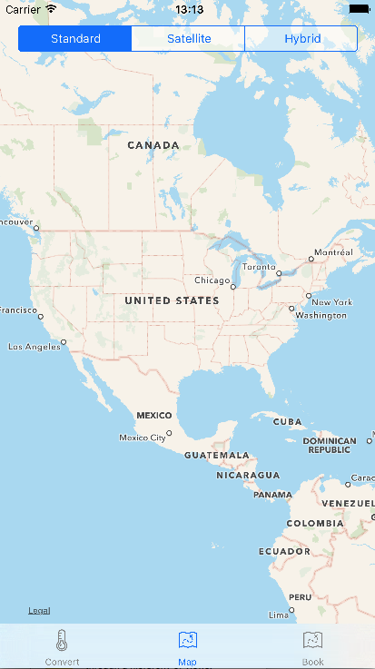

# WorldTrotteriOS

A simple iOS app that:

-Converts temperatures between Celsius and Fahrenheit
-Provides map for exploring the globe
-Connects to Hipmunk for quick travel booking

WorldTrotter also includes internationalization features and (currently) is localized in English and Spanish.

##Converter view

##Map view

##Book view

